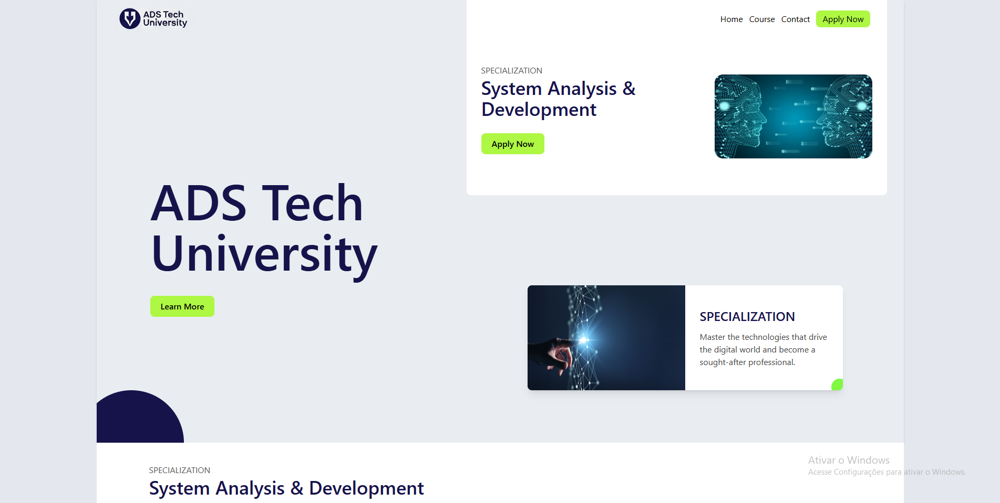

# ADS Tech University - Landing Page



## 📖 Sobre o Projeto

Este projeto é a criação de uma landing page responsiva para a "ADS Tech University", uma faculdade fictícia com foco em Análise e Desenvolvimento de Sistemas. Foi desenvolvido como um projeto pessoal para aplicar e demonstrar habilidades em design de interface (UI), experiência do usuário (UX) e desenvolvimento front-end moderno, utilizando HTML5 e Tailwind CSS.

O objetivo foi criar uma interface envolvente e informativa para apresentar a universidade e seu curso principal a potenciais alunos.

---

## ✨ Funcionalidades Principais

* **Design Moderno e Profissional:** Uma interface limpa e visualmente atraente, focada na apresentação clara das informações.
* **Seções Chave Implementadas:**
    * Seção Hero com título impactante e call-to-action.
    * Apresentação do curso de "System Analysis & Development".
    * Cards destacando as vantagens e diferenciais da faculdade.
    * Elementos visuais customizados para enriquecer o design.
* **Construído com Tailwind CSS:** Utiliza o framework CSS utilitário para um desenvolvimento ágil e customização eficiente da estilização.

---

## 🛠️ Tecnologias Utilizadas

* HTML5
* CSS3
* [Tailwind CSS](https://tailwindcss.com/) (via CDN)
* Git & GitHub para versionamento de código

---

## 🚀 Acesso ao Projeto

Você pode visualizar o projeto [**CLICANDO AQUI**](https://talissondevv.github.io/ads-tech-university/) ou seguindo os passos abaixo para rodar localmente.

### Para rodar localmente:

1.  **Clone o repositório:**
    ```bash
    git clone [https://github.com/Talissondevv/ads-tech-university.git](https://github.com/Talissondevv/ads-tech-university.git)
    ```
2.  **Navegue até o diretório do projeto:**
    ```bash
    cd ads-tech-university
    ```
3.  **Abra o arquivo `index.html` no seu navegador.**

---

## 📸 Screenshots


---

## 📄 Licença

Este projeto está licenciado sob a [**MIT License**](LICENSE).

---

## 💬 Contato

Talisson Faria
* LinkedIn: [Talisson Faria](https://www.linkedin.com/in/talissondev/)
* GitHub: [Talissondevv](https://github.com/Talissondevv)
* Email: `talissonfelipedesouzafaria@gmail.com`